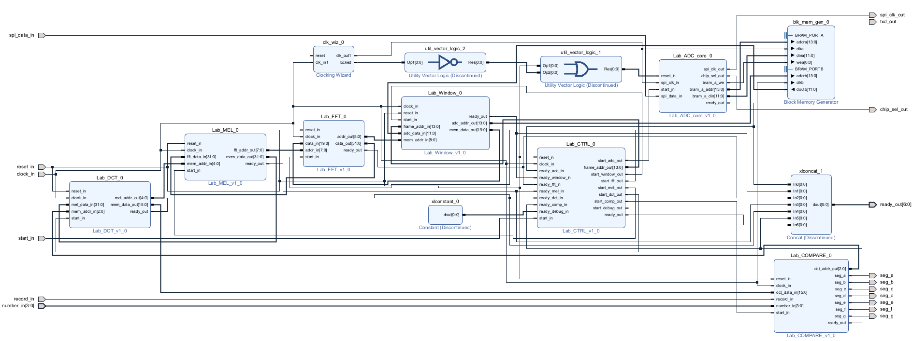
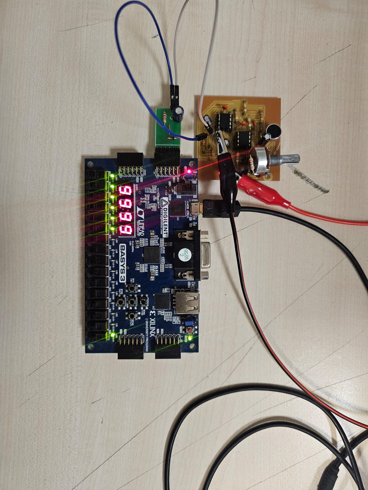

# FPGA-Based Spoken Number Recognition System

## Overview

This repository contains the implementation of a **Spoken Number Recognition System** developed as part of the **EEE 491 – Electrical and Electronics Engineering Design I** course at Bilkent University.

The project focuses on the complete design, development, and implementation of a speech recognition system capable of identifying spoken numerical digits and operating on an FPGA platform. The work integrates concepts from multiple areas of electrical and electronics engineering, including analog circuit design, signal processing, digital system design, hardware description languages, and embedded hardware implementation.

The primary objective was to gain experience with the full engineering design cycle, from algorithm development and simulation to hardware realization and testing.

---

Project's Block Design Diagram



---

Project in FPGA



## Project Objectives

* Design and implement a spoken number recognition system.
* Process and analyze speech signals acquired through an audio front-end.
* Develop and validate recognition algorithms using MATLAB.
* Processing architectures into VHDL.
* Implement and test the system on Basys3.
* Evaluate system performance.

---

## System Architecture

The complete system consists of the following stages:

1. **Audio Acquisition**

   * Speech input captured through a microphone interface.
   * Analog front-end conditioning and signal amplification.
   * ADC converting analog waves to dighital series.

2. **Signal Processing**

   * Speech processing and feature extraction.
   * MATLAB-based MFCC implementation.

3. **Digital Hardware Design**

   * Functional standalone modules described in VHDL.
   * Behavioral simulations.
   * Migrating SA modules to top level Block Desing and wiring modules

4. **FPGA Implementation**

   * Synthesis and deployment on the Basys3 FPGA board.
   * Real-time processing and recognition of spoken digits.

5. **Testing and Verification**

   * Simulation verification.
   * Hardware debugging.

---

## Tools and Technologies

### Software

* MATLAB
* Xilinx Vivado
* LTspice
* Diptrace

### Hardware

* Basys-3 FPGA Development Board
* Audio acquisition circuitry
* ADC IC

### Languages

* VHDL
* MATLAB

---

## Engineering Topics Covered

This project combines concepts from:

* Digital System Design
* FPGA Design and Implementation
* Signal and Speech Processing
* Analog Electronics
* Digital Electronics
* Embedded Systems
* Hardware Verification and Testing

---

## Repository Structure

```text
├── Matlab Codes/     # Speech processing and algorithm development
├── IPs/              # IP description files
├── hardware/         # Circuit schematics and PCB-related files
├── Manuals/          # Lab documentation
└── docs/             # Additional project resources
```

---

## Results

The implemented block design system demonstrates the complete workflow of a speech recognition on FPGA hardware. The project performing speech based numerical recognition using MFCC calculated in FPGA.

---

## Course Information

**Course:** EEE 491 – Electrical and Electronics Engineering Design I
**Department:** Electrical and Electronics Engineering
**Institution:** Bilkent University

This project was completed as part of the senior design curriculum and includes an intensive workload in implementing VHDL modules and Vivado IP/Block design imp.
